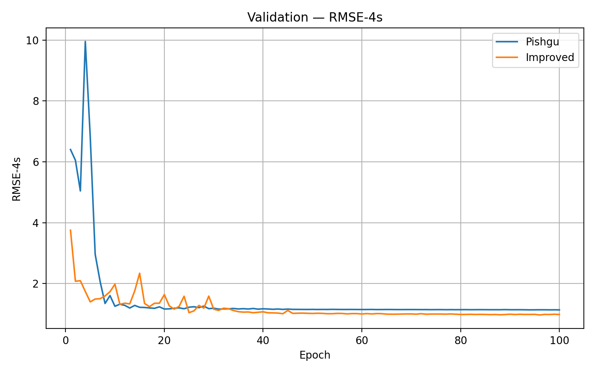

<a id="readme-top"></a>

[![Contributors][contributors-shield]][contributors-url]
[![Forks][forks-shield]][forks-url]
[![Stargazers][stars-shield]][stars-url]
[![Issues][issues-shield]][issues-url]
[![Apache License][license-shield]][license-url]


<br />
<div align="center">

<h3 align="center" style="font-size: 2em;">End to end vehicle trajectory prediction</h3>
  <p align="center">
    <a href="https://github.com/AlterraFa/End-to-end-vehicle-trajectory-prediction">View Demo</a>
    &middot;
    <a href="https://github.com/AlterraFa/End-to-end-vehicle-trajectory-prediction/issues/new?labels=bug&template=bug-report---.md">Report Bug</a>
  </p>
</div>


<details>
  <summary>Table of Contents</summary>
  <ol>
    <li>
      <a href="#about-the-project">About The Project</a>
    </li>
    <li><a href="#validation-metrics-comparision">Validation metrics comparision</a></li>
    <li><a href="#usage">Usage</a></li>
      <ul>
        <li><a href="#installation">Installation</a></li>
        <li><a href="#generate-tensor-data">Generate Tensor data</a></li>
        <li><a href="#training-and-testing">Train and testing</a></li>
        <li><a href="#visualizing-the-result">Visualizing the result</a></li>
      </ul>
    <li><a href="#collaborators">Collaborators</a></li>
    <li><a href="#license">License</a></li>
    <li><a href="#contact">Contact</a></li>
    <li><a href="#citation">Citation</a></li>
  </ol>
</details>


<!-- ABOUT THE PROJECT -->
## About The Project

![Product Name Screen Shot][trajectory-gif]

This project is a fork of another scietific paper titled `Pishgu: Universal Path Prediction Network Architecture for Real-time Cyber-physical Edge Systems`. The original Pishgu framework is a pioneering end-to-end system specifically designed for the challenging task of predicting the trajectories of multiple vehicles within highway environments, leveraging a bird's-eye view (BEV) perspective for robust spatial understanding. Our project aims to comprehensively review the existing Pishgu methodology and then implement targeted modifications to enhance its performance, focusing on improved prediction accuracy, computational efficiency, and robustness in various real-world driving scenarios.

Details of our improvement are in the [Documentation](./Document.pdf)

## Validation Metrics Comparision

Below are our comparision between our method and Pishgu.

<!-- automatically-generated ↓ -->
| .png) | .png) |
|-------------------------------|------------------------------|
|  |  |
|  |  |
|  |                              |
<!-- end automatically-generated -->

Across every evaluation metric—**FDE**, **ADE**, and **RMSE** at 1-5 seconds—our improvements are both consistent and significant. Not only do we observe lower endpoint and average displacement errors, but the multi-horizon RMSE curves for our model uniformly lie below those of Pishgu, indicating more accurate long-term trajectory predictions. These gains underscore the effectiveness of our architectural enhancements and training strategy in crowded-scene forecasting.

## Datasets

* Vehicle Bird's eye view: [NGSIM](./datasets/ngsim/) dataset
* Pedestrian Bird's eye view: [UCY](./datasets/High/) and [ETH](./datasets/Eye/) dataset


## Usage

### Installation

1. Clone the repo
   ```sh
   git clone https://github.com/AlterraFa/End-to-end-vehicle-trajectory-prediction.git
   ```
2. Install Python packages
   ```sh
   cd PishguImprove
   pip install -r requirements.txt
   ```
### Generate tensor data

Each domain has a corresponding Dataset file in datasets folder. Before training, ensure that you have the cached file with extenstion `*Dset.pt`. If not, generate the data through the following:

1. Make the cache folder
    ```sh
    mkdir processedDataset
    ```
2. Generate cache dataset
    ```sh
    cd PishguImproved
    python3 utils/dataMaker.py --name {dataset_name} --batch-size {batch_size} --workers {number_of_workers}  
    ```
### Training and Testing

To train the model with the generated cached tensor data, use the following command:
```sh
python3 PishguImproved/main.py
```
For testing:
```sh
python3 PishguImproved/Inference.py
```
Note: Ensure you're in the base directory.

### Visualizing the result
To visualize how the model predicts, similar to [About the project](#about-the-project) section
```sh
python3 runAnimatedTest.py
```


### Collaborators:

<div>
  <a href="https://github.com/AlterraFa" target="_blank" rel="noopener">
    
  </a>
  <a href="https://github.com/vtnguyen04" target="_blank" rel="noopener">
    
  </a>
</div>

<!-- LICENSE -->
## License

Distributed under the Apache License. See `LICENSE.txt` for more information.


<!-- CONTACT -->
## Contact

Your Name - [@twitter_handle](https://twitter.com/twitter_handle) - ntony8124@gmail.com@gmail.com

Project Link: [https://github.com/AlterraFa/End-to-end-vehicle-trajectory-prediction](https://github.com/AlterraFa/End-to-end-vehicle-trajectory-prediction)


## Citation

  ```
  @article{messaoud2021attention,
    author  = {Messaoud, Kaouther and Yahiaoui, Itheri and Verroust-Blondet, Anne and Nashashibi, Fawzi},
    title   = {{Attention Based Vehicle Trajectory Prediction}},
    journal = {IEEE Transactions on Intelligent Vehicles},
    volume  = {6},
    number  = {1},
    pages   = {175--185},
    year    = {2021},
    doi     = {10.1109/TIV.2020.2991952}
  }
  ```

  ```
  @article{noghre2022pishgu,
    title   = {Pishgu: Universal Path Prediction Architecture through Graph Isomorphism and Attentive Convolution},
    author  = {Noghre, Ghazal Alinezhad and Katariya, Vinit and Pazho, Armin Danesh and Neff, Christopher and Tabkhi, Hamed},
    journal = {arXiv preprint arXiv:2210.08057},
    year    = {2022}
  }
  ```
  ```
  @article{katariya2023pov,
    title   = {A POV-based Highway Vehicle Trajectory Dataset and Prediction Architecture},
    author  = {Katariya, Vinit and Noghre, Ghazal Alinezhad and Pazho, Armin Danesh and Tabkhi, Hamed},
    journal = {arXiv preprint arXiv:2303.06202},
    year    = {2023}
  }
  ```
  
  ```
  @misc{quancore_social_lstm,
    author       = {Nama, Baran and Mirs King},
    title        = {{Social LSTM implementation in PyTorch}},
    year         = {2025},
    publisher    = {GitHub},
    howpublished = {\url{https://github.com/quancore/social-lstm}},
    note         = {Accessed: 2025-07-11}
  }

  ```


<!-- MARKDOWN LINKS & IMAGES -->
<!-- https://www.markdownguide.org/basic-syntax/#reference-style-links -->
[contributors-shield]: https://img.shields.io/github/contributors/AlterraFa/End-to-end-vehicle-trajectory-prediction.svg?style=for-the-badge
[contributors-url]: https://github.com/AlterraFa/End-to-end-vehicle-trajectory-prediction/graphs/contributors
[forks-shield]: https://img.shields.io/github/forks/AlterraFa/End-to-end-vehicle-trajectory-prediction.svg?style=for-the-badge
[forks-url]: https://github.com/AlterraFa/End-to-end-vehicle-trajectory-prediction/network/members
[stars-shield]: https://img.shields.io/github/stars/AlterraFa/End-to-end-vehicle-trajectory-prediction.svg?style=for-the-badge
[stars-url]: https://github.com/AlterraFa/End-to-end-vehicle-trajectory-prediction/stargazers
[issues-shield]: https://img.shields.io/github/issues/AlterraFa/End-to-end-vehicle-trajectory-prediction.svg?style=for-the-badge
[issues-url]: https://github.com/AlterraFa/End-to-end-vehicle-trajectory-prediction/issues
[license-shield]: https://img.shields.io/github/license/AlterraFa/End-to-end-vehicle-trajectory-prediction.svg?style=for-the-badge
[license-url]: https://github.com/AlterraFa/End-to-end-vehicle-trajectory-prediction/blob/master/LICENSE.txt
[trajectory-gif]: figures/trajectory.gif
